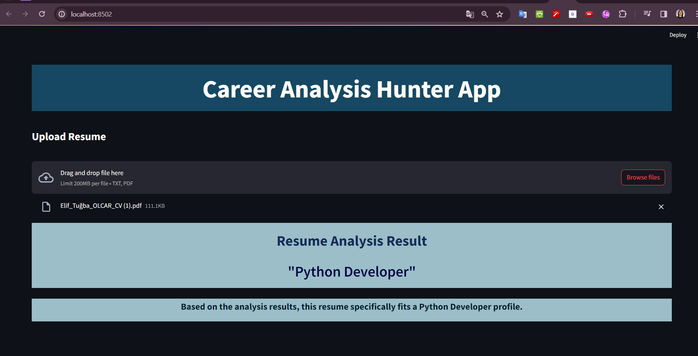

# Career_Analysis_Hunter_App

# Resume Analysis 

## Introduction

Human resources and recruitment processes can become complex and time-consuming, especially when faced with the need to review a large number of resumes. This article focuses on a Natural Language Processing (NLP) project aimed at automating and simplifying the resume review process. Our goal is to effectively categorize resumes using machine learning and text analysis techniques, ultimately identifying suitable candidates for specific job roles.

## Project Overview

In this project, we have a total of 25 different job categories. In the initial phase, we conducted data visualization to understand and interpret the data. Subsequently, we employed machine learning techniques to train the data, achieving an impressive 98.4% accuracy.

